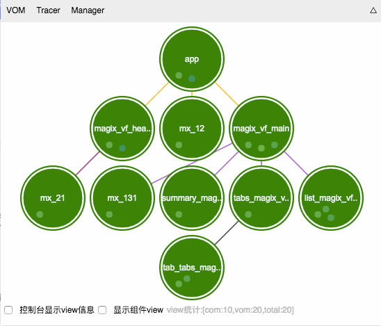

# Magix Inspector [](https://github.com/thx/magix-inspector/ "Version Number") [](https://thx.github.io/ "THX Team") [](https://opensource.org/licenses/MIT "License") [](https://www.npmjs.com/package/magix-inspector)

Magix项目的调试分析工具，直观的展示区块间的层级关系、事件绑定、数据共享、mixins等。实时以不同颜色显示渲染情况，正确渲染的区块以绿色表示，其它颜色则表示需要改进，鼠标移到相应的区块上会有关联提示



# 使用

`npm install magix-inspector`

然后在html页面中通过script引入，如

```html
<script src="node_modules/magix-inspector/src/index.js"></script>
```

或引入线上的js

```html
<script src="https://thx.github.io/magix-inspector/index.js"></script>
```


或通过书签的方式添加一段js代码：

```js
javascript:void(((d,l,s,b)=>{b=(x,e,g)=>{s=d.createElement('script');s.src=l.pop();g=()=>{clearTimeout(x)};e=()=>{g();if(l.length)b();else alert('load magix inspector error')};s.onerror=e;s.onload=g;x=setTimeout(b,5e3);s.charset='utf-8';d.body.appendChild(s)};b()})(document,['https://thx.github.io/magix-inspector/index.js','https://unpkg.com/magix-inspector','https://unpkg.alibaba-inc.com/magix-inspector','https://cdn.jsdelivr.net/npm/magix-inspector']))
```

在运行Magix项目的页面上点击添加的书签，既可使用线上的Magix Inspector来查看区块间关系

## 安装chrome扩展

感谢邱德清同学提供的代码，详情请访问这里：https://github.com/qiu-deqing/magix-helper
